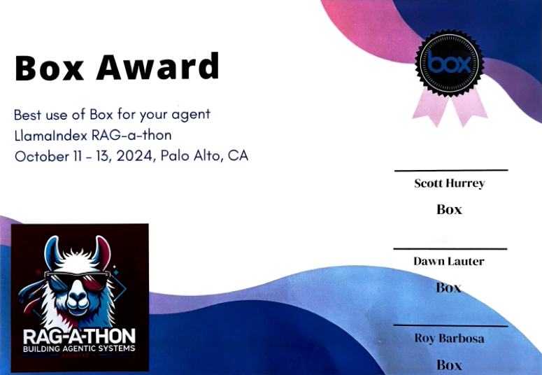

🚧 Repository Restructuring in Progress 🚧

We wanted to give you a heads-up that this repository is currently undergoing some restructuring to improve organization, maintainability, and scalability. 

# RAGformation

## Project name
- RAGformation

## Problem Statement
- Enterprises have a tough time estimating how much cloud infrastructure will cost, and how it will look like?

## Solution
- Tailored cloud solutions based on use case, cost, and preferences using natural language with Agentic AI to research, design, price, diagram, and report an optimized result.

## Built with
- LlamaIndex
- Pinecone
- Box
- LlamaCloud
- Python
- React

# About the Project

# Inspiration
## Breaking the Cloud Complexity Barrier: Accelerate Innovation with Automated Cloud Optimization

In today's hyper-competitive landscape, businesses rely on cloud infrastructure not just to scale but to innovate at lightning speed. Yet, navigating the complex array of services across various cloud platforms often becomes a bottleneck. The process of selecting the right services, estimating costs, and designing architectures can stretch into weeks, wasting precious time and resources.

We envisioned a solution that turns this challenge into an opportunity. Our platform automates cloud service selection, pricing, architecture design, and reporting—across the big three cloud providers and beyond.

Whether you're leveraging AWS, Azure, Google Cloud, or exploring more vertically integrated providers, our tool guides you to the most efficient and cost-effective solutions for your business. Need to compare EC2 with a more focused service? Want to integrate the latest industry-leading innovations? Our platform tailors recommendations based on your specific needs while pulling in insights from real-time blogs, reviews, and emerging trends—ensuring that your business stays ahead of the curve.

While our architecture is designed to handle the “big three” cloud giants, it’s equally adept at helping businesses tap into specialized providers that offer vertically integrated solutions, potentially driving better value and alignment with specific use cases. By making it easy to pivot between platforms or adopt a multi-cloud strategy, we empower companies to embrace flexibility without sacrificing efficiency.

The impact is transformative:

- Accelerate Time-to-Deployment: Bypass the traditional delays. Get your tech teams building faster than ever before.
- Empower Leadership Decisions: Access immediate, detailed cost reports and architecture visuals. Make strategic choices with confidence and clarity.
- Optimize ROI: Custom recommendations mean no more over-provisioning or under-utilizing resources. Every dollar is maximized for efficiency and effectiveness.
- Stay Agile and Competitive: By automating cloud service selection and cost estimation, your business can respond rapidly to changing needs, without missing a beat.
- Imagine reducing a process that typically stretches over weeks into a streamlined workflow completed in hours. Imagine the agility, the competitive edge, and the innovation     unleashed. That’s not just efficiency—that’s a game-changer.

Our mission is to future-proof your cloud journey—whether you're optimizing across AWS, Azure, Google Cloud, or exploring alternative providers that align with your unique business needs. We ensure that your cloud architecture remains adaptable, cost-efficient, and at the forefront of technological innovation.

Step into the future of cloud infrastructure with us, where complexity becomes simplicity, and possibilities become realities. Let’s not just adopt the cloud—let’s redefine what’s possible within it.

# What it does

With RAGformation, users can simplify cloud complexity and accelerate innovation effortlessly. By simply inputting their specific use case into our platform, users receive an optimal cloud service plan tailored to their needs. Utilizing Llama Index Workflows, RAGformation generates a flow diagram that visually represents the suggested cloud services suited for their project.

From this flow diagram, our platform provides detailed pricing information for the entire proposed cloud services setup. If users wish to refine the recommendations, RAGformation adjusts the flow diagram based on their feedback, offering alternative services or configurations. Once the user confirms the optimized flow, the tool finalizes the pricing and generates a comprehensive report.

Users are empowered to make informed decisions quickly, with visual representations and cost insights at their fingertips—transforming what was once a complex, time-consuming process into a seamless experience.

# How we built it

1. **User Interaction:**
   - The user inputs a use case and confirms the suggested cloud services flow.
   - Use case information and flow confirmation are collected.
   - The user's budget is used to inform the overall project cost.

2. **Data Collection:**
   - Scraping data from the web for solutioning and pricing.
   - Sources include blog posts, IEEE papers, and cloud services documentation.
   - Utilizing pricing APIs.
   - Importing diagram functions for building flow diagrams.

3. **Technical Implementation:**
   - Implementing a Llama Cloud and Pinecone RAG (Retrieval-Augmented Generation) solution for service suggestion and flow building.
   - Using LlamaCloud-hosted Pinecone and Box.
   - Box is used to store all the web-scraped data.
   - Creating a vectorized knowledge base for RAG pipelines using Pinecone.

4. **Agent Process:**
   - An orchestrator works with agents to accomplish tasks.
   - Collecting requirements from the user.
   - RAG retrieves cloud services information and diagram imports.
   - Interpreting suggested services to build flow diagrams.
   - Iteratively enhancing and generating cloud flow diagrams.
   - Estimating the price for the suggested cloud flow.
   - Generating a report of the confirmed flow with pricing.

5. **Output Generation:**
   - Outputting the generated report from the agent process.
   - Providing a PDF version of the flow diagram, pricing, and details of the confirmed suggested flow.
   - The app outputs a suggested optimal list of cloud services with pricing and the cloud flow in a PDF report.

# Challenges we ran into

- LLama workflow integration with agents
- Box upload and retrieval in Llama cloud
- Diagram generation with cloud services imports
- Dynamic parameters for Pricing API needed by cloud services
- Connecting react to llama workflow

# Accomplishments That We're Proud Of

We are proud to have created **RAGformation**, an application that makes selecting and optimizing cloud services much easier and faster. By simplifying cloud complexity, we've empowered businesses to accelerate innovation without getting bogged down in the intricacies of cloud architecture. Our tool helps organizations quickly design tailored cloud solutions, optimize costs, and stay agile in a rapidly evolving tech landscape. We believe RAGformation will enable companies to focus more on driving growth and delivering value, rather than navigating the often daunting world of cloud services.

- What we learned
  
# What's Next for RAGformation

While we've made significant strides with RAGformation in simplifying cloud complexity, we're excited about the possibilities for further enhancement. Our future plans include:

- **Fine-Tuning Smaller Models:** We're aiming to optimize and fine-tune smaller machine learning models within RAGformation. This will increase efficiency and speed, allowing users to receive faster recommendations while reducing computational resources.

- **Comparative Analysis Across Cloud Services:** We plan to expand RAGformation's capabilities to provide comprehensive comparisons of different cloud services. By offering side-by-side evaluations, users can design the most effective cloud flow that balances performance and budget, whether they're considering AWS, Azure, Google Cloud, or specialized providers.

- **Support for Diverse Input Types:** To make the tool even more user-friendly, we'll enable support for various input formats such as images, PowerPoint presentations, Excel spreadsheets, and more. This flexibility will allow users to input their requirements in the format that suits them best, streamlining the process further.

- **Integration with Emerging Technologies:** Looking ahead, we intend to incorporate cutting-edge technologies like AI-driven cost optimization and predictive analytics. This will help users anticipate future needs and adjust their cloud architectures proactively.

- **Enhanced Customization and Personalization:** We're working on features that allow for deeper customization based on user preferences and historical data. This means even more tailored cloud solutions that align perfectly with each organization's unique requirements.

- **Real-Time Collaboration Tools:** Introducing collaboration features will enable teams to work together within RAGformation, making it easier to coordinate on cloud architecture decisions and share insights instantly.

Our commitment is to continuously evolve RAGformation to meet the growing and changing needs of businesses. By focusing on these improvements, we aim to make cloud optimization not just easier, but a catalyst for innovation and growth.
